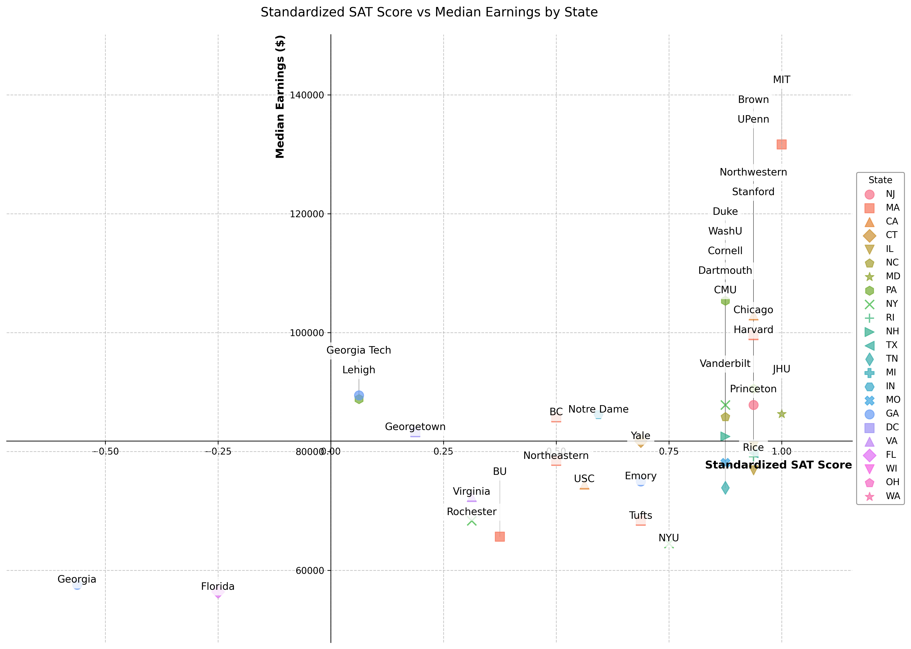
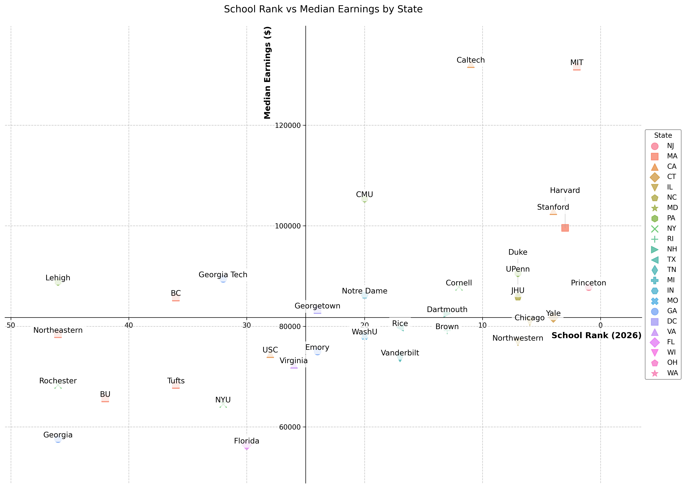
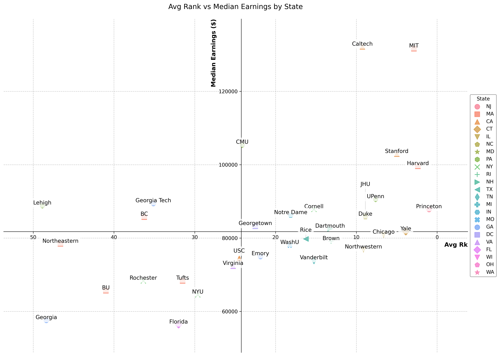

# Rank, Score, and Success: Analyzing University Impact on Earnings   

**Group Members**: Razan Almasood, Chenzi Jin, Yi Wu, Yuxin Zhao  

## Project Abstract  
This project aims to explore the relationship between university rankings, admission scores, and post-graduation earnings of students. To conduct the project, we first crawled data from the *U.S. News & World Report's Best Colleges Rankings*, including rankings, tuition, average SAT scores at admission, and state information for the top 50 U.S. universities in 2026. Next, we collected historical data and mean data from 2018 to 2025 for the *U.S. News* university rankings from Public University Honors for 160 universities. Subsequently, we gathered post-graduation earnings data for various universities from College Transitions.  
After collecting the data, we integrated it into a cross-sectional dataset, including university names, states, yearly rankings from 2018 to 2026, average SAT scores at admission, and median post-graduation earnings. We then performed visualization and basic empirical analysis on the data. In the visualization section, we plotted the relationships between university rankings, admission SAT scores, and median earnings on a coordinate system, finding a strong correlation between SAT scores and median earnings, while the correlation between university rankings and earnings levels was weaker.  
In the empirical analysis section, we conducted OLS regression on the cross-sectional data with tuition interaction terms, further providing empirical evidence for the trends observed in the visualizations. However, due to the data being at the university level and the lack of multi-year earnings, tuition, and SAT score data, the project cannot employ panel data analysis methods or conduct heterogeneity analysis, and the causality of the findings remains to be improved.  

## Project Goal  
1. Collect cross-sectional data at the university level through web scraping to enable preliminary analysis of earnings at the institutional level.  
2. Use data visualization to display trends in the relationships between university rankings, admission SAT scores, and post-graduation earnings levels.  
3. Employ basic empirical methods, introducing preliminary control variables and interaction terms, to demonstrate trends in the relationships between university rankings, admission SAT scores, and post-graduation earnings levels.  

## Sources of datasets  

### U.S. News & World Report's Best Colleges Rankings  
**Includes:** Tuition fees, SAT score range, location (state), and ranking data.  
**URL:** `https://www.usnews.com/best-colleges/rankings/national-universities?myCollege=national-universities&_sort=myCollege&_sortDirection=asc`

### Public University Honors  
**Includes:** U.S. News school ranking data from 2018 to 2025, and their average rankings.  
**URL:** `https://publicuniversityhonors.com/us-news-rankings-2025-which-universities-have-gained-or-lost-the-most-since-2018/`

### College Transitions  
**Includes:** Multi-period graduate earnings data.  
**URL:** `https://www.collegetransitions.com/dataverse/graduate-earnings/`  

## Running Guide  

**Ensure Dependencies are Installed**: Please make sure you have installed all the libraries listed in `requirements.txt` before proceeding.  
**Execute the Main Script**: Run `code/main.py` from the project directory. Since all functions are encapsulated within it, this will automatically restart the entire workflow starting from data scraping.  
**Output Locations**:   
The function will save results in the `artifacts/` and `plot/` folders. The artifacts folder contains:  
`artifacts/graduate_earnings_data.csv`, `artifacts/PUHranking.csv`, `artifacts/tuition&sat_top50.csv`, and `artifacts/usnews_top50.csv`, which are the raw table data obtained from web scraping.
`artifacts/cleaned_merged_dataset.csv`, the final cleaned and merged dataset. `artifacts/regression.csv`, the results of the regression analysis.  
The `plot/` folder includes all visualization images generated from the analysis.

## Visualization Findings  

### Strong Positive Correlation Between SAT Scores and Median Earnings  

In the first plot (Standardized SAT Score vs Median Earnings), we observe a strong positive relationship: schools with higher average standardized SAT scores tend to have higher graduate median earnings.  
- Institutions like MIT, Stanford, UPenn, and Brown cluster in the top-right quadrant, showing both high SAT scores and high earnings (above $120,000).  
- In contrast, schools like Florida and Georgia have both lower SAT scores and lower earnings (around $60,000).  
**SAT scores may proxy for student academic ability or selectivity, which appears linked to labor market outcomes.**  

### School Rank Is Not a Perfect Predictor of Earnings  

The second plot (School Rank vs Median Earnings) shows that rank alone doesn’t consistently predict graduate earnings.  
- MIT and Caltech, ranked at the top, have extremely high earnings (above $140,000).  
- However, Yale, Brown, and Chicago, despite top rankings, cluster near the $80,000 mark.  
- Meanwhile, CMU and Georgia Tech, which are ranked lower, outperform in earnings—CMU exceeding $100,000.  
**School prestige matters, but program strength, STEM focus, and employer perception may drive better earnings beyond rank.**  

### Tuition Does Not Guarantee Higher Earnings  

In the third plot (Standardized Tuition vs Median Earnings), we see that higher tuition doesn’t necessarily correspond with higher median salaries.  
- High-tuition schools like MIT and Caltech do offer strong earnings.  
- Yet schools like NYU, BU, and Tufts have similarly high tuitions but notably lower graduate earnings.  
- On the other hand, Georgia Tech and Florida have below-average tuition but offer solid returns (especially Georgia Tech).  
**Students should evaluate return-on-investment (ROI), not just sticker price—some public or lower-cost schools offer high economic mobility.**  

### Higher Average (Worse) School Rank Is Associated with Lower Median Earnings  

In the fourth plot, we observe a clear negative relationship: schools with better average rankings tend to offer higher post-graduate earnings.  
- MIT, Caltech, Harvard, Stanford, all with average rank near 0, consistently show the highest graduate earnings (above $120,000).  
- In contrast, schools like BU, Georgia, Rochester, with average ranks above 40–50, are concentrated in the lower-right quadrant, showing lower median earnings (around $60,000–$70,000).  
- Georgia Tech and Lehigh stand out slightly by outperforming others in their rank range, but still do not reach top-tier earning levels.  
**Students from schools with consistently high rankings tend to earn more, likely due to stronger reputations, networks, and employer recognition. Average school rank is a reasonably good predictor of earnings potential.**

### Geographic Trends and Regional Clustering  

Color and shape coding by state reveals geographic patterns in performance:  
- Northeastern states (e.g., MA, NY, PA) dominate the upper-right areas of several plots—hosting high-ranking, high-earning schools like Harvard, MIT, UPenn.  
- Southern states (e.g., FL, GA) tend to cluster in lower-left quadrants with lower SAT, tuition, and earnings outcomes.  
**State and region may influence outcomes due to factors like regional industry demand, alumni networks, and access to top employers.**

## Empirical Methodology  

We construct the following two regression models and estimate them using OLS with cross-sectional data, clustering standard errors at the state level:  

**Regression 1:**
%20+%20\epsilon_i)

**Regression 2:**
%20+%20\epsilon_i)

## Empirical Findings  

### Regression 1:  
At the 10% significance level, a one-unit increase in a university's average ranking (lower rank number indicates a better ranking) is associated with a significant increase of $2,684 in students' median earnings six years post-graduation. However, neither tuition nor the interaction term between average rank and tuition is statistically significant.  

### Regression 2:
At the 5% significance level:  
- A one-point increase in the average SAT score of admitted students is associated with a significant increase of $629 in median earnings six years post-graduation.  
- A $1 increase in tuition is associated with a significant increase of $10 in median earnings six years post-graduation.  
- The interaction term between SAT score and tuition is negative and significant, indicating that:  
  - Higher tuition reduces the positive effect of SAT scores on post-graduation earnings.  
  - Higher SAT scores reduce the positive effect of tuition on post-graduation earnings.  

### Implications:  
1. Higher SAT scores may reflect greater peer intellectual ability, potentially enhancing post-graduation earnings through social networks.  
2. The effect of tuition on earnings six years post-graduation requires further investigation. Higher tuition might indicate stronger family backgrounds, which could facilitate better social networks and higher earnings. Alternatively, at higher-tuition private universities, students may focus more on liberal arts and classical studies, which may yield lower labor market returns compared to STEM fields.  
3. Tuition and SAT scores exhibit a moderating effect on post-graduation earnings. When tuition is sufficiently high, students' family backgrounds may be affluent enough that earnings are less dependent on individual ability, rendering university quality, peer intelligence, and social networks less influential. Conversely, when admission standards (SAT scores) are sufficiently high, the signaling value of the university degree reduces the impact of tuition and associated family capital on earnings.  

## Data Limitations  

From an economic perspective, analyzing the impact of university characteristics or SAT scores on individual earnings requires individual-level data. Our use of university-level data only captures average trends at the institutional level, which may not reflect individual-level outcomes.  
Our dataset is limited to the top 50 universities in the *U.S. News Best National Universities Rankings*, which lacks representativeness. These institutions are typically elite private universities or state flagship public universities, all of which offer high-quality educational resources. Earnings heterogeneity among these universities may primarily stem from regional wage differences or disciplinary compositions. Additionally, our dataset excludes liberal arts colleges, which are a significant component of U.S. higher education.  
Furthermore, the earnings data from *College Transitions* are based on follow-up surveys conducted years after graduation, while the ranking and SAT data do not correspond to the same cohort of graduates, introducing potential bias. The absence of historical SAT scores and tuition data in the *U.S. News & World Report's Best Colleges Rankings* prevents us from using panel data methods for more robust causal inference.  

## Future Extensions  

Ideally, we would collect anonymized individual-level longitudinal data, including graduates' university, university ranking, admission SAT scores, tuition at enrollment, and multi-period earnings data. This would significantly enhance the causal validity of our findings.  
If individual-level data are unavailable, we aim to collect more comprehensive university-level data, including all universities and liberal arts colleges in the *U.S. News Best National Universities Rankings*. Additionally, obtaining detailed multi-year data on disciplinary student ratios, family background and ethnic compositions, and discipline-specific SAT averages would facilitate panel data analysis and support heterogeneity analysis.  

## Workflow  

### Step 1: School Rank and State Data Collection

**Contributor:** chenzi JIN  
**File:** `code/data_collection.py`     
**Function:** `fetch_rankings_state()`

- Collects top 50 university rankings and state data from US News API
- Uses official API endpoint with proper sorting by ranking position
- Implements pagination to ensure complete data collection
- Handles JSON data extraction with error handling
- Saves structured data to CSV format using relative paths
- Tested locally with successful generation of rankings dataset

**Output File:**
`artifacts/usnews_top50.csv`

### Step 2: Tuition and SAT Data Collection

**Contributor:** Ralmasood  
**File:** `code/data_collection.py`  
**Function:** `collect_sat_tuition()`

- Scrapes tuition and SAT data for the top 50 U.S. universities using the US News API  
- Handles API pagination and nested JSON traversal to extract key fields  
- Saves results in CSV format under `artifacts/tuition&sat_top50.csv`  
- Includes progress logging and error handling for  
- Tested locally with successful data export   

**Output File:**  `artifacts/tuition&sat_top50.csv`

### Step 3: Graduate Earnings Data Collection

**Contributor:** Yuxin Zhao
**File:** `code/data_collection`  
**Function:** `scrape_college_earnings()`

- Scrapes graduate earnings data from the College Transitions website using requests and BeautifulSoup
- Extracts the institution names and corresponding median earnings 6 years after entry
- Skips invalid or missing entries (e.g., "--") during scraping to ensure clean and usable data
- Cleans and standardizes institution names for consistency with other datasets
- Stores the final cleaned results in CSV format under artifacts/graduate_earnings.csv

**Output File:**  `artifacts/graduate_earnings_data.csv`

### Step 4: Average School Rank Collection

**Contributor:** Yi Wu  
**File:** `code/data_collection.py`  
**Function:** `scrape_puh_rankings()`

- Parses table information from the URL using BeautifulSoup
- Uses regular expressions to match data for 160 schools, including US News rankings from 2018 to 2025 and average rankings
- Stores and cleans the data to create analyzable panel data
- Matches school names, updating top-ranked schools to their official names for easier data cleaning
- Saves results in CSV format under `artifacts/PUHranking.csv`

**Output File:**  `artifacts/PUHranking.csv`
**Output File:**  
`artifacts/PUHranking.csv`
